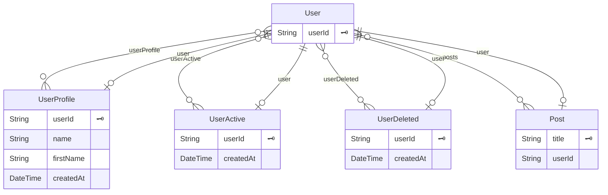

```mermaid
erDiagram

  "User" {
    String userId "🗝️"
    }
  

  "UserActive" {
    String userId "🗝️"
    DateTime createdAt 
    }
  

  "UserProfile" {
    String userId "🗝️"
    String name 
    String firstName 
    DateTime createdAt 
    }
  

  "UserDeleted" {
    String userId "🗝️"
    DateTime createdAt 
    }
  

  "Post" {
    String title "🗝️"
    String userId 
    }
  
    "User" o{--}o "UserProfile" : "userProfile"
    "User" o{--}o "UserActive" : "userActive"
    "User" o{--}o "UserDeleted" : "userDeleted"
    "User" o{--}o "Post" : "posts"
    "UserActive" o|--|| "User" : "user"
    "UserProfile" o|--|| "User" : "user"
    "UserDeleted" o|--|| "User" : "user"
    "Post" o|--|| "User" : "user"
```
